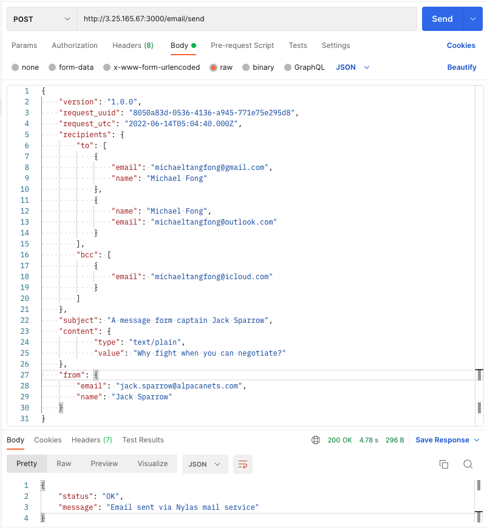

# Technical Challenge for (Michael) Tang Tat Fong

## Project Explains
This project intends to build a node server which provide RESTful API for sending email and the main purpose for this challenge is to program a switchover mechanism that swap to secondary Email provider ([Mailgun](https://www.mailgun.com/)) if main service ([Nylas](https://www.nylas.com/)) failed.

Project is created using Express framework, however challenge works are mainly written in three areas as explained below:
* /lib/models
* /lib/services
* /routes/email/send.js


```bash
.
├── lib                           
    ├── models                    
        ├── MailBase.js           # Mail base class
        ├── Nylas.js              # Nylas Class inherit MailBase
        ├── Mailgun.js            # Mailgun Class inherit MailBase
        ├── SendGrid.js           # SendGrid Class inherit MailBase
    ├── services                  
        ├── MailServices.js       # provides send email function and switchover feature
├── routes
    ├── email
        ├── send.js               # validate API message and handle request 
```

### Testing public server
URL: http://3.25.165.67:3000/email/send

Send an email using curl:
```shell
curl --location --request POST 'http://3.25.165.67:3000/email/send' \
--header 'Content-Type: application/json' \
--data-raw '{
    "version": "1.0.0",
    "request_uuid": "8050a83d-0536-4136-a945-771e75e295d8",
    "request_utc": "2022-06-14T05:04:40.000Z",
    "recipients": {
        "to": [
            {
                "email": "youremail@mail.com",
                "name": "You Name"
            }
        ],
        "cc": [
            {
                "email": "ccemail@mail.com"
            }
        ]
        "bcc": [
            {
                "email": "bccemail@mail.com"
            }
        ]
    },
    "subject": "A message form captain Jack Sparrow",
    "content": {
            "type": "text/plain",
            "value": "Why fight when you can negotiate?"
    },
    "from": {
        "email": "jack.sparrow@alpacanets.com",
        "name": "Jack Sparrow"
    }
}'
```
Respond:
```shell
{
    "status": "OK",
    "message": "Email sent via Nylas mail service"
}
```

> * when email is sent via Nylas, you may receive email from michaeltangfong@gamil even the "from" parameter were provided, this is because Nylas replace it with the (only allowed) registered email address in sandbox environment.
> * you may not be able to send cc or bcc if using Mailgun service, both of them are not allowed in sandbox environment.


Alternatively, you can use [postman](https://www.postman.com/):




___


## Development

**Project Requirements**
* Node.js (v18)
* NVM
* Yarn (optional)

**Initial checkout:**

```shell
git clone git@github.com:michaeltangfong/siteminder-node-mail-api.git
cd siteminder-node-mail-api

npm install
# or 
yarn install
```


**Configuration**

Create `.env` file and update configuration value respectively
```shell
# copy from configuration template file
cp .env.template .env
```


**Initial project and start application:**
```shell
# make nvm to use preferred node version 
nvm use
```
```shell
# start project
npm start 
# or 
yarn start
```

**making request using curl**
```shell
curl --location --request POST '127.0.0.1:3000/email/send' \
--header 'Content-Type: application/json' \
--data-raw '{
    "version": "1.0.0",
    "request_uuid": "8050a83d-0536-4136-a945-771e75e295d8",
    "request_utc": "2022-06-14T05:04:40.000Z",
    "recipients": [
        {
            "to": [
                {
                    "email": "youremail@mail.com",
                    "name": "You Name"
                }
            ],
            "cc": [
                {
                    "email": "ccemail@mail.com"
                }
            ],
            "bcc": [
                {
                    "email": "bccemail@mail.com"
                }
            ]
        }
    ],
    "subject": "A message form captain Jack Sparrow",
    "content": {
        "type": "text/plain",
        "value": "Why fight when you can negotiate?"
    },
    "from": {
        "email": "jack.sparrow@alpacanets.com",
        "name": "Jack Sparrow"
    }
}'
```

### Message properties summary ###

| Property              | Datatype | Optional |                                            Sample Data |                                                   Remark |
|-----------------------|:--------:|---------:|-------------------------------------------------------:|---------------------------------------------------------:|
| version               |  String  |        N |                                                "1.0.0" |                                          service version |
| request_uuid          |  String  |        N |                 "8050a83d-0536-4136-a945-771e75e295d8" |                                        unique request id |
| request_utc           |  String  |        N |                             "2022-06-14T05:04:40.000Z" |                                         request time utc |
| recipients            |  Array   |        N |                                                        |                    envelope of message, array of  object |
| recipients &#124; to  |  Array   |        N | [{"email":"youremail@email.com"},{"name":"Your Name"}] |                                      array of recipients |
| recipients &#124; cc  |  Array   |        Y | [{"email":"youremail@email.com"},{"name":"Your Name"}] |                     array of carbon copy (cc) recipients |
| recipients &#124; bcc |  Array   |        Y | [{"email":"youremail@email.com"},{"name":"Your Name"}] |              array of blind carbon copy (bcc) recipients |
| subject               |  String  |        N |                  "A message form captain Jack Sparrow" |                                            email subject |
| content               |  Object  |        N |          {"type":"text/plain","value":"email content"} | email type and content, currently support plaintext only |
| from                  |  Object  |        N |   {"email":"youremail@email.com"},{"name":"Your Name"} |                                           sender address |

*alternatively you are free use any API client (e.g. Postman ) to send request.*

## Todo & enhancements list
1. Complete Mail class property validation.
2. Complete test case scenarios.
3. Check email class properties before send.
4. Customise validation error message to be more generic.
5. enable multiple recipient, cc or bcc in Gunmail production account, currently those features are not supported.


## Enhancements
1. Implement authentication.
2. Message encryption.
3. Implement graphQL instead.
4. Keep API Request record in Database.
5. Implement an email enquiry API.
6. Deploy script to generate pre-launch / production `.env` configuration.
